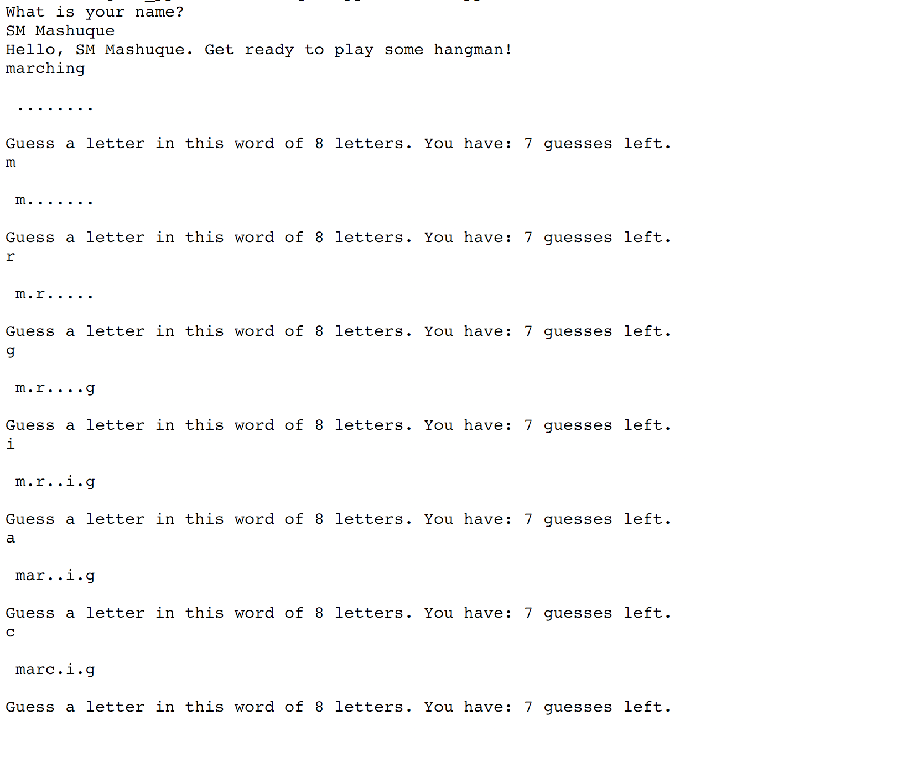

# hangman_game_python_c_plus_plus

In this project, we implement a simple Hangman game that you can play with the Python console. 

The purpose of this project is to learn how to integrate C++ with Python.

Game business logic will be calculated by using C++ functions, and Python will 
be mostly used to start, and end the game, and to print out information to the user about the state 
of the game.

How to play:

You can clone the repository and type in terminal: "python ./main.py" to start 
the game. 

Additional Info: 
1. I did the initial research, identified what functions could be written in C++, and
setup C++ code to work with Python with the help of ctypes library. 
2. The C++ functions used in `main.py` are written in the file `_c_lib.cc` and the 
corresponding compatible functions are written in the file `c_lib.py`. Our main.py 
game file calls the functions from the 'c_lib.py' 
3. A total of 6 functions were identified. I wrote 3 of them and the other three were 
written by my teammates. 
4. I also created a Python script to generate `random_words.dat`, which contains
a list of 7938 words, so that we could easily pick a random number C++ and choose 
the word at that index from the `random_words.dat` file.